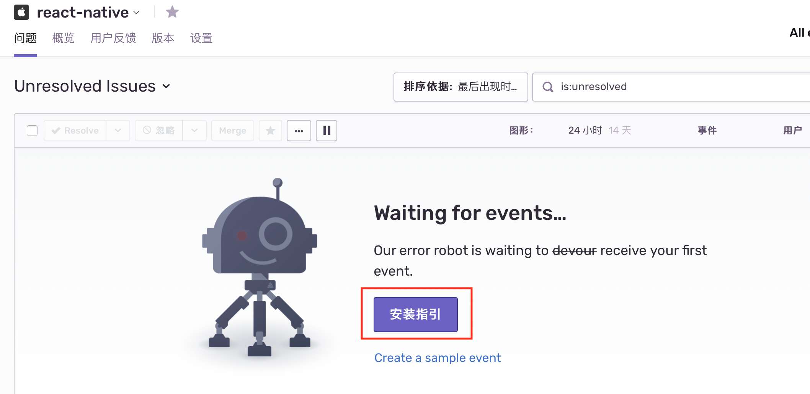
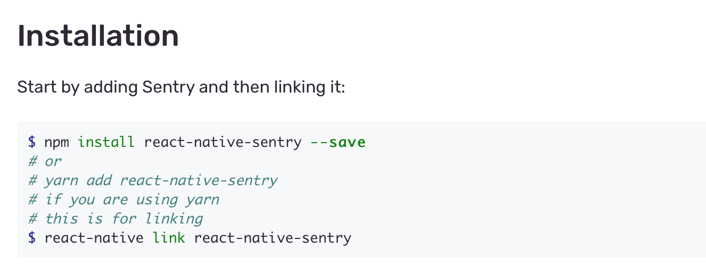
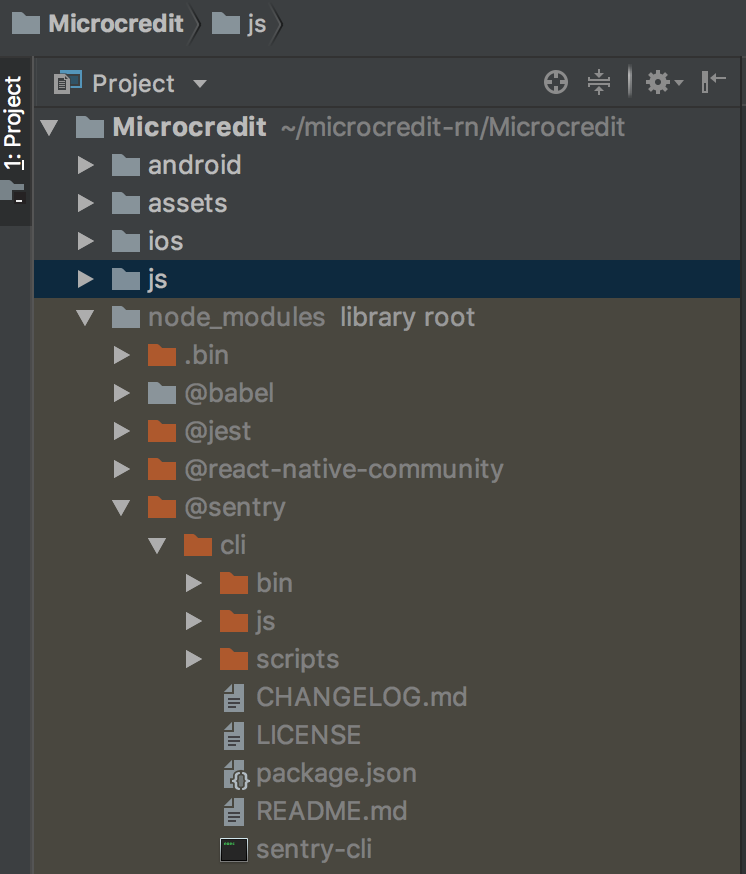
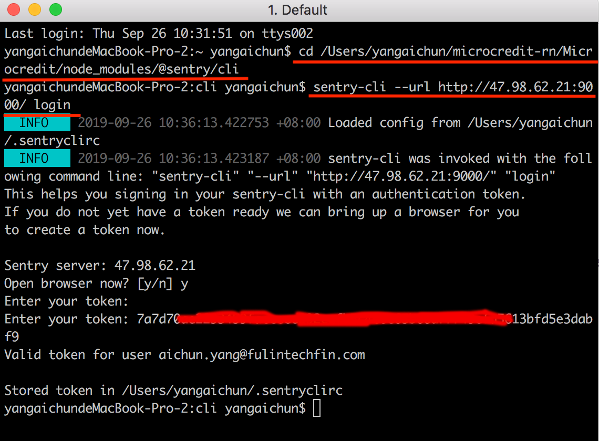
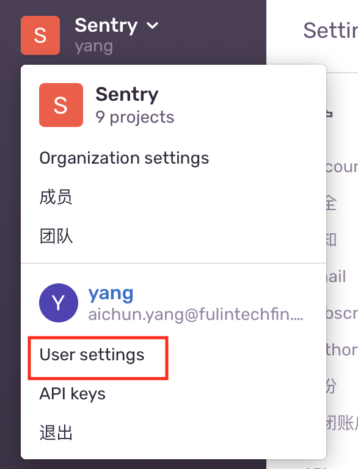
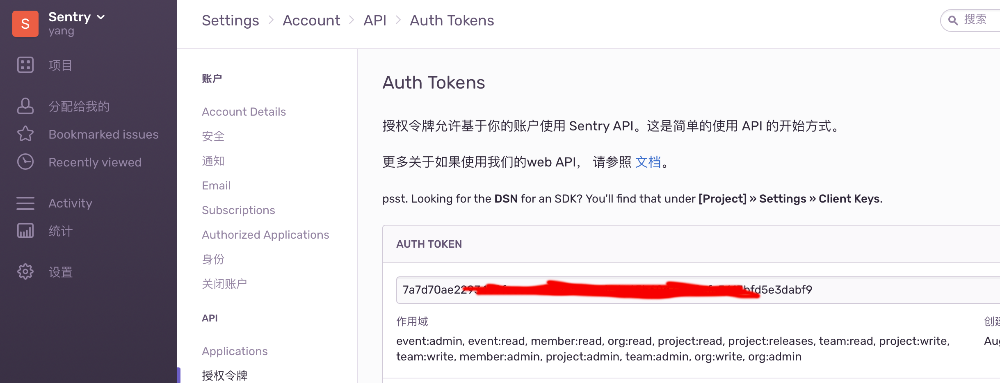
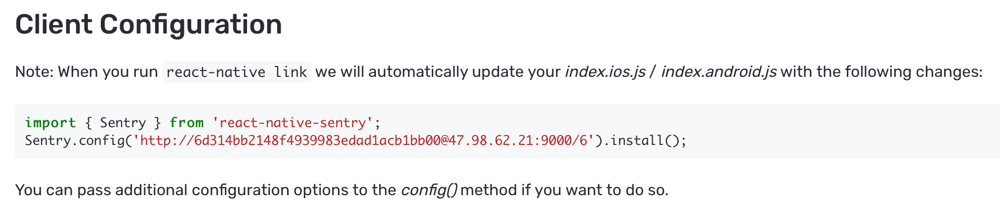
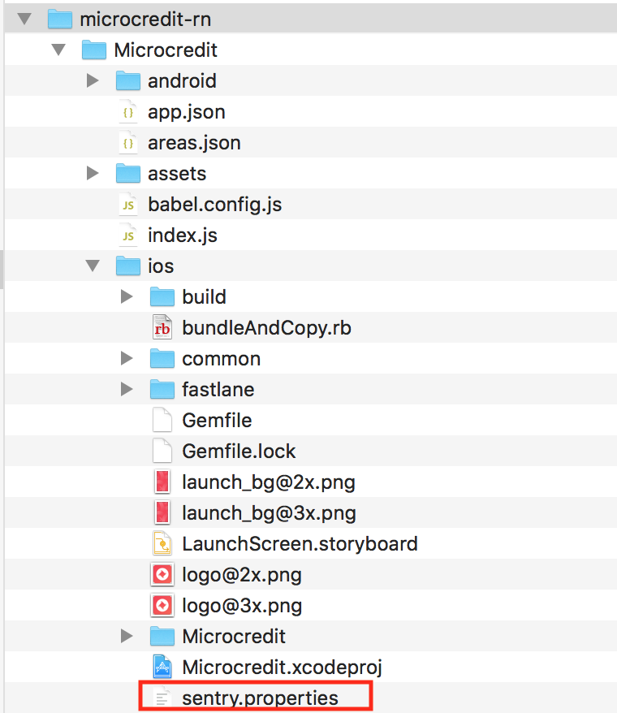
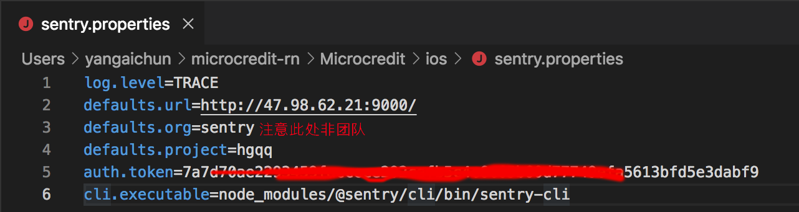

# 索引

* [在Sentry管理后台创建项目](#在Sentry管理后台创建项目)
* [ReactNative项目中安装npm包](#ReactNative项目中安装npm包)
* [配置Sentry](#配置Sentry)

## 在Sentry管理后台创建项目

找管理员开通帐号及权限后，登录管理后台创建ReactNative项目，如下图


## ReactNative项目中安装npm包

创建项目后进入项目，根据安装指引进行npm包的install和link





link过程中sentry-cli会调浏览器加载sentry官网要求用户登录，因为我们是自建的服务，所以这一步取消，关掉终端即可。下面我们通过sentry-cli到我们自建服务的地址进行登录。

1、打开终端，cd到sentry-cli目录



2、指定到自建服务地址进行登录

```
sentry-cli --url http://47.98.62.21:9000/ login
```



登录成功后auth_token会保存到用户目录下.sentryclirc文件。若用户已登录会提示输入token，token在管理后台查看(后面配置sentry.properties也会用到)，如下图





##配置Sentry

##### 按照安装指引在项目的index文件中配置sentry



##### 配置sentry.properties

因为之前link中断了，所以需要分别在项目的android,ios目录下创建sentry.properties文件



sentry.properties文件内容如下



注意此处org是组织名，非团队名，之前没注意还有个组织名填成团队名导致一直上传sourcemap失败。组织名在管理后台查看，如下图


